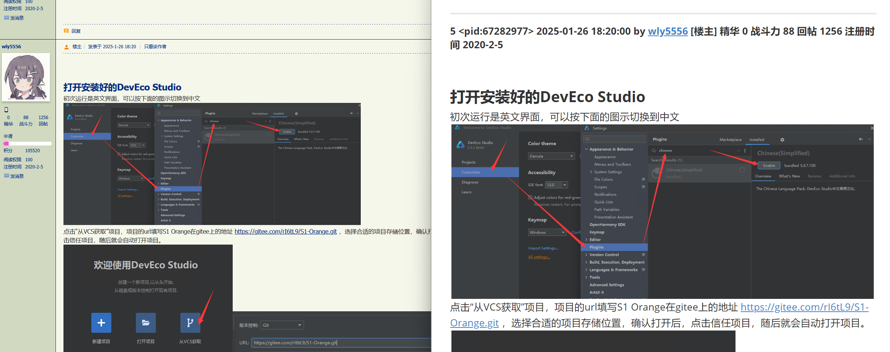
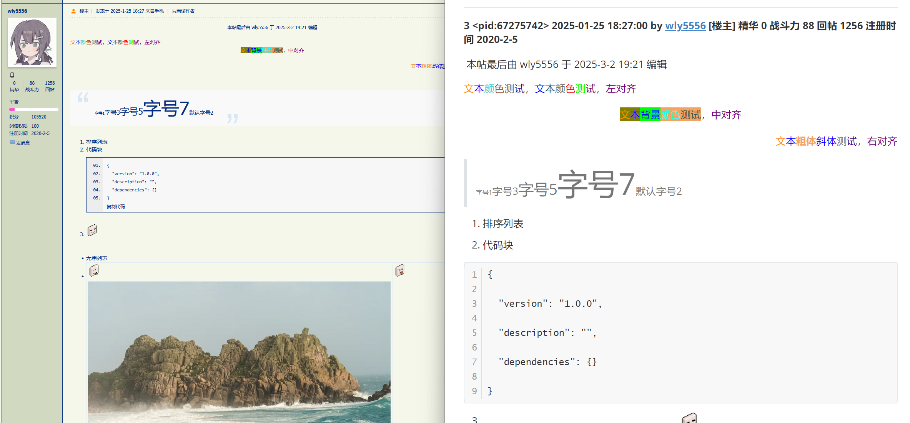

# stage1stpost2md

魔改自[ngapost2md](https://github.com/ludoux/ngapost2md)。非常草台，凑合用吧。

stage1stpost2md 是一个将 stage1st 论坛帖子转换为 Markdown 格式的工具。它支持快速爬楼并存储回复人、时间和内容，同时支持保存正文图片。还可以一键更新所有已下载过的帖子。

更新帖子时，只会从之前爬到的最后一层开始下载新的帖子。之前的帖子如果编辑过不会进行更新。

## 运行效果

示例帖子tid=2244111






## 使用说明

### 通过命令行运行

1. 下载并解压发布版本的压缩包。
2. 修改 config.ini 文件中的配置项，根据需要进行相应的修改，确保 `config.ini`  文件存在且与可执行文件在同一目录下（平级关系）。
3. 打开终端或命令提示符，**并确保终端所在目录即为程序所在目录，否则程序可能无法正确读取配置文件**。
4. 运行以下命令，并执行程序：

windows
```
.\stage1stpost2md.exe 5935947
```
参数为帖子的 tid，如上述命令里的 5935947。

如果只爬取特定作者的帖子，在后边添加 `-a` 参数，如：

~~~
.\stage1stpost2md.exe 5935947 -a 123456
~~~

如果需要输出到其他目录，在后边添加 `-d` 参数，如：

~~~.\stage1stpost2md.exe 5935947
.\stage1stpost2md.exe 5935947 -d D:\posts\
~~~

注意要以 `\` 结尾。路径名不能有空格。也可以使用`.\`表示当前目录。


使用`-l 帖子路径.txt`命令时会把`帖子路径.txt`里面每行的路径自动更新，下载新的楼层。如：

```
.\stage1stpost2md.exe -l C:\folder\帖子路径.txt
```

`帖子路径.txt`里面每行一个路径，表示要更新的帖子，如：

```
D:\folder\stage1stposts\*
D:\folder\2250988-穹庐下的魔女 TV动画化
```

支持两种语法，

- `C:\2250988-穹庐下的魔女 TV动画化` 表示把这个路径当成一个帖子更新
- `C:\threads\*` 表示把这个路径下每个文件夹当成一个帖子更新

也可以使用`.\`表示当前目录。

5. 程序会开始爬取帖子内容并将其转换为 Markdown 格式，转换后的文件将保存在当前目录。

参数详情
```
> .\stage1stpost2md.exe -h
使用: ngapost2md tid [--authorid aid]
选项与参数说明: 
tid: 待下载的帖子 tid 号
aid: 只看某用户 id 发言层，需配合 --authorid 参数

ngapost2md -v, --version     显示版本信息并退出
ngapost2md -h, --help        显示此帮助信息并退出
ngapost2md -u, --update      检查最新版本
ngapost2md -l, --listupdate      更新txt文件中所有路径的帖子
ngapost2md --gen-config-file 生成默认配置文件于 config.ini 并退出
ngapost2md -d, --dir 导出位置
```

**不要使用`ngapost2md -u`，没修改这个功能，不知道会发生什么。**

### 通过脚本运行

脚本会自动运行同目录下的`stage1stpost2md.exe`。

两个脚本的用法：修改config.ini里面的配置之后，打开`下载帖子.bat` 输入tid和保存地址即可。

打开`自动更新帖子.bat` 输入需要更新的路径文档，里面每行路径都会被更新。参考上面`-l`部分。

## 配置说明

详见config.ini注释

在 release 页面的打包文件中，config.ini 文件与主程序平级。不要用程序生成的默认配置文件。

## 注意事项


- 请确保您的网络连接正常，并且能够访问 stage1st 论坛。
- 请遵守 stage1st 论坛的相关规定和版权要求。
- 请使用合法、合规的方式进行爬取，遵守网站的爬虫规范和使用协议。
- 请尊重网站的服务器负载和带宽限制，避免对其造成过大的压力。
- 请避免频繁的请求和大量的并发连接，以免对网站的正常运行造成干扰。
- 转换过程可能需要一些时间，具体时间取决于帖子的页数和内容数量。
- **登录需要把账号密码明文写在config.ini中，请自行审阅登录相关代码。被盗号、封号概不负责。建议用小号。**
- config.ini丢失后请重新下载，不要使用软件自动生成的版本。

## 资瓷与不资瓷格式说明

资瓷的有：

- newline 换行
- pic 图片（会下载下来）
- smile 表情（和图片一样下载下来）
- quote 回复与引用
- strikeout 删除线
- url 超链接
- 修改了颜色字号字体的文本（反白字体可能需要在不渲染的时候才能看到）
- 居中和右对齐的文本
- 有序列表、无序列表
- 代码块（中间可能会有额外的空行）
- 投票（格式稍微有点乱）
- 置顶帖子（会当成没有置顶在正确的楼层处保存，也不会有置顶标记）

不资瓷的有：
- 表格，会丢掉表格格式下载文字。论坛的表格可以嵌套引用和列表，markdown不支持。
- 二手交易区里面的商品信息，文字会下载下来但是格式混乱
- 附件，只会把链接下载下来。（不会有人在s1传附件吧）
- 以附件形式上传的图片。图片会下到本地正常显示，但是上面会有冗余信息

## 已知问题

如果有置顶回帖，需要第一次下载的页数包括最后一个置顶，否则中间的楼层会被跳过，保存为空楼层。

## Special Thanks

- 特别感谢 ngapost2md 原作者的开发！

